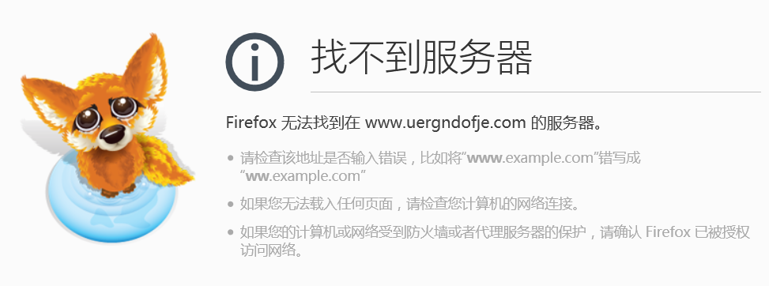
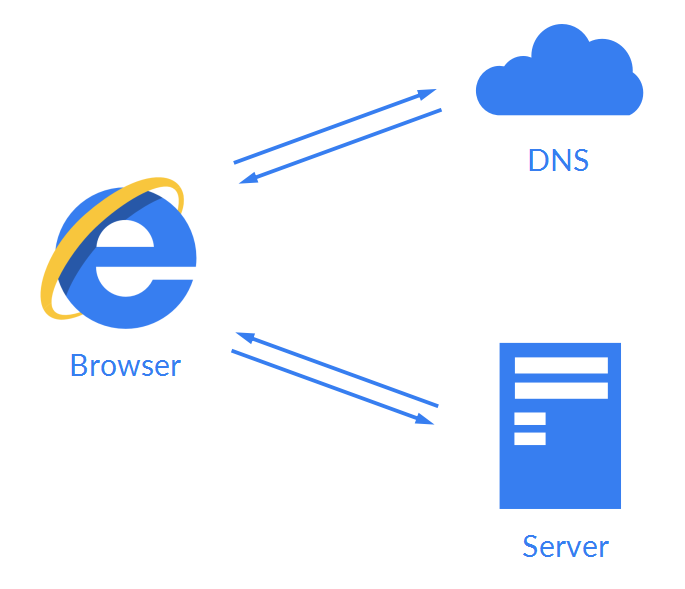

# Tutorial 1 什么是 Web

> *关键词：*网站、浏览器、网址、服务器、互联网

在正式开始学习 Web 开发之前，你需要了解一下关于 Web 的一些基本概念。在这一讲中，我们将从熟悉的**“网站” (Website)** 出发，一步一步挖掘出互联网的组成。事实上，看似简单的“网站”背后，隐藏着一个庞大而有序运转着的巨型系统。而正是由这个系统得以上所有的网站稳定地运行着。这个系统的名字叫做**“互联网” (Internet)**，而我们所熟知的**万维网 (World Wide Web, aka. Web)** 正是依靠于互联网运行的一种服务。

是不是对上面的一排定义和名词感觉有些晕乎乎的？不要着急，我们马上来详细地解释它们。

## 网站

在信息化浪潮席卷下的现代社会中，由无数计算机组成的**网络 (Network)** 将整个世界联系在了一起。在现代社会中，计算机早已普及到了家家户户，同样普及的还有宽带服务。无数的宽带接入到家家户户，紧接着无数的人们又能时时刻刻与整个世界交流沟通。而在这打交道的过程中，我们所熟悉的一个概念就是**“网站” (Website)**。

网站的准确定义十分枯燥，它是由数个相关联的网页组成的集合。网站对于我们更熟悉的形式，可能是在浏览器的地址栏中呈现的形如`http://www.163.com` 的文本了。只需在浏览器地址栏中输入这样的一段文本，按一下回车键，“网易”这个网站就会出现在你的面前。甚至还有更容易的形式：只需在搜索框中输入“网易”进行搜索，点击第一条搜索结果，我们也可以访问到这个网站。

*我们所熟悉的地址栏*

如果在平时有更仔细地观察地址栏的话，你可能会发现在同一个网站（比如“网易”）中，访问不同页面时地址栏上的文本是不同的。比如，在访问首页时，地址栏的文本可能是 `http://www.163.com`；但在看一条新闻的时候，地址栏的文本则变成了 `http://news.163.com/16/1002/21/XXXXXXXXXXX.html` 的形式。尽管这两种文本的开头大体相同（都是 `163.com`），但是不同页面的地址是不一样的。更进一步地说，网站中的页面和地址存在着对应关系，或者说存在着映射 (Mapping)。我们可以尝试得出这样一个结论：**对于每一个网页，它的地址都是唯一的；同时对于每一个地址，它也对应着唯一的一个网页。**我们姑且认为这是个正确的结论（事实上，这个结论有一些问题，我们会在以后提到）。我们把这个唯一的地址称作**统一资源定位符 (Uniform Resource Locator, URL)**。尽管 URL 的概念十分重要，现在我们并不打算详细讨论它。不过我们现在已经知道，通过 URL，我们可以找到万维网中的任意一个网页。

现在再来理解网站的概念就要容易一些了。正如刚才我们所看到的，同一个网站下的网页，它们的 URL 的开头部分是大体相同的，这表明这些网页也是由同一公司或是个人所提供的。网易提供的网页都会以 `163.com` 开头，而不会以 `baidu.com` 开头；百度提供的网页都会以 `baidu.com` 开头，而不会以 `163.com` 开头。我们把这一开头部分称作**域名 (Domain Name)**。通常来说，一个域名标识着一个网站。我们也可以申请一个域名，来建立属于自己的网站，相关内容在 [Lab 1](../lab-1/index.html) 中会详细阐述。

## 浏览器

仅仅有他人提供网站在万维网中是远远不够的，它们只是存在于互联网中的资源而已。我们需要有途径能够访问到这些网站。**浏览器 (Browser)** 就是其中的一种方式。浏览器作为我们访问万维网的窗口，帮我们实现了访问网站的功能，同时也屏蔽了其中复杂的细节。只需要输入 URL，浏览器就能够帮我们找到资源所在的位置，然后去那里拿回来我们需要的数据，并把它以网页的形式展现出来。从更抽象的一个层面上来说，浏览器帮助我们完成了访问网站的所有工作，也就是作为一个**用户代理 (User Agent)** 在履行着职责。

既然我们要进行 Web 开发，那么对浏览器的了解就应该更深入一些。让我们不妨剖开它漂亮的外表，看看它究竟是怎么帮我们拿到网页数据的。让我们做几个小试验，来推断一下浏览器工作的原理。

首先，我们尝试输入一个不存在的域名，比如说 `http://www.uergndofje.com`。不出意外的话，你会看到一个错误页面，这应该并不意外。在正常情况下，这个错误页面应该是类似这样的：

> 注意：
> 不幸的是，在国内有些地区，浏览器可能会跳转到一个奇怪的运营商相关的页面。我们在此不讨论相关问题，只是提醒一下可能出现的情况。

*正常情况下的错误页面 (Firefox)*

**找不到服务器！**浏览器是这样告诉我们的。那么服务器又是什么呢？事实上，**服务器 (Server)** 是对外提供网站和其他互联网服务的计算机。因此，我们需要访问服务器才能够拿到网页的数据。但首先的问题是：服务器在哪里呢？事实上，浏览器会通过我们输入的 URL 帮我们找到网站对应的服务器。这一过程需要**域名系统 (Domain Name System, DNS)** 来完成，现在我们知道有这个过程就足够了。

让我们继续进行试验。现在让我们访问一个存在的域名，但 URL 对应的网页应该是不存在的，比如 `https://github.com/notexistpage.html`。不出意外的话，我们仍然会看到一个错误页面。不过这个页面呈现的都是跟网站相关的信息了。换句话说，这个页面是由网站提供的，而不是由浏览器提供的。在这一个过程中，显然浏览器已经能够成功访问到了服务器，但是 URL 对应的网页并不存在，服务器无法返回有效的网页，于是返回给我们了一个包含错误信息的页面。而浏览器也没能获取正确的页面，于是便将它拿回来的错误页面呈现了出来。

*网页不存在时的错误页面*

这一类页面也被称作“404 页面”，通常这是由网站自定义的用于网页不存在时呈现的页面。从这个例子中可以看到，浏览器不仅能为我们获取和呈现网页的内容，并且还能应对绝大多数情况下的错误。而这从中的细节，都已经被浏览器完全隐藏起来了。

最后，让我们用一张图来简单概括浏览器所做的事：

*浏览器的原理图*

## 互联网

在对浏览器有了一些了解后，让我们再回到网络的主题上。当今的计算机网络已经构成了一个极度庞大而复杂的系统，全世界的计算机藉以各种方式连接到了名为**互联网 (Internet)** 的全球性网络中。互联网为了当今世界中信息传播的最为重要的渠道，空前量级的数据在这个巨大的网络中传输。除了**万维网 (World Wide Web)** 以外，互联网还提供了其他各式各样的网络服务，包括邮件、聊天、网络游戏等诸多方面。而万维网只能提供网页和其他多媒体资源，通过浏览器等途径才能访问。

互联网是建立在诸多层级的复杂系统上的，从最底层的物理层到最顶层的应用层均有各自的协议规范。在这里，我们只需要了解到，是互联网让计算机连接了起来，构成了庞大的信息网络，从而提供网站等一系列的信息服务，让信息在全世界范围内快速交融。

## 总结

在对互联网和万维网有了基本的了解之后，我们将会接下来正式开始 Web 开发的学习之旅。在体验 Web 开发的魅力之前，我们建议尝试一下 [Lab 1](../lab-1/index.html) 来搭建一个属于自己的个人博客。在做好前进的准备之后，点击下一页吧。

## 参考资料

1. [Internet](https://en.wikipedia.org/wiki/Internet) by Wikipedia
2. [World Wide Web](https://en.wikipedia.org/wiki/World_Wide_Web) by Wikipedia 
3. [Website](https://en.wikipedia.org/wiki/Website) by Wikipedia
